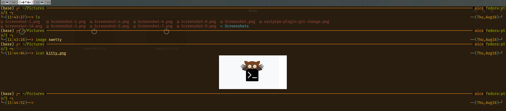

# Demo



# Platform

> any linux platform
> but test on Fedora 34+

# Usage

> install by running the following command

```sh
chmod +x install
./install
```

# Keymap

> <Ctrl-Shift-v> -> 粘贴选中的内容

> <Alt-v> -> 垂直分屏

> <Alt-h> -> 水平分屏

| --- | --- |
| <Ctrl-Shift>H | 光标跳转到左边的屏幕 |
| <Ctrl-Shift>J | 光标跳转到下边的屏幕 |
| <Ctrl-Shift>K | 光标跳转到上边的屏幕 |
| <Ctrl-Shift>L | 光标跳转到右边的屏幕 |
| <Ctrl-Shift>C | 复制选中的内容 |
| <Ctrl-Shift>I | vim 模式查看 |
| <Ctrl-Shift>D | 下一个 tab |
| <Ctrl-Shift>B | 上一个 tab |
| <Ctrl-Shift>T | 新建一个 tab |
| <Ctrl-Shift>S | kitty shell |
| <Ctrl-Tab> | 切换 tab |
| <Ctrl-Shift>U | 输入 unicode |
| <Ctrl-Shift>, | 移动 tab 到左边|
| <Ctrl-Shift>. | 移动 tab 到右边|
| <Ctrl-Alt-C> | 编辑配置文件 |
| <Alt> number | 跳转到指定的 tab |
| <Ctrl-D> | 关闭窗口 |
| <Ctrl-N> | 新建系统窗口 |
| <Ctrl-Q> | 切换窗口大小 |
| <F5> | 加载配置文件 |

# Command

```sh
# list supported fonts
kitty +list-fonts

```

# Version

> 1.2.1

# more

[zsh](https://github.com/TBBtianbaoboy/zsh) zsh is useful with kitty
[neovim](https://github.com/TBBtianbaoboy/nvim-coc-awesome) is a useful editor with above
